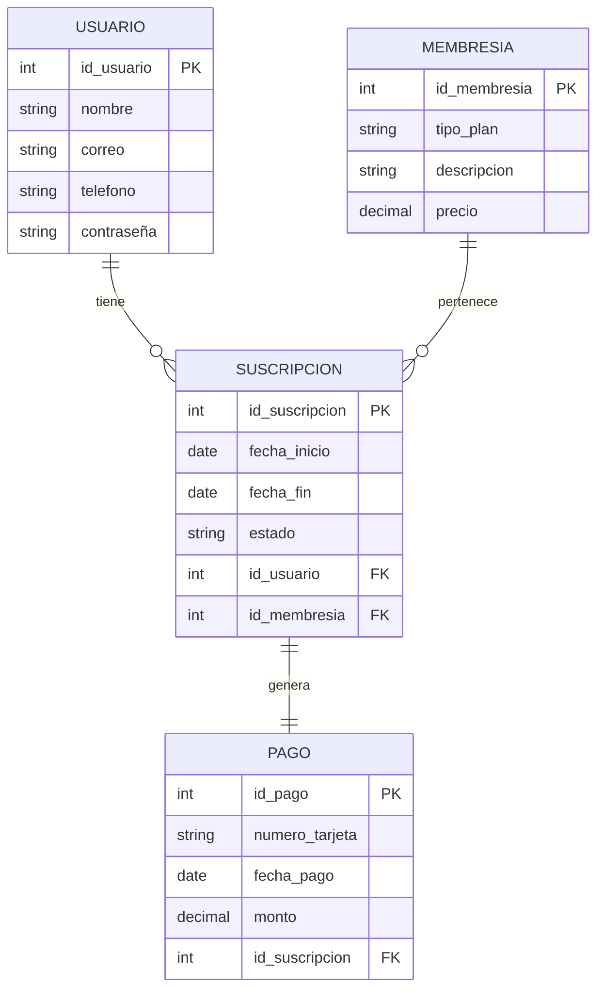

```mermaid
erDiagram

    USUARIO {
        int id_usuario PK
        string nombre
        string correo
        string telefono
        string contraseña
    }

    MEMBRESIA {
        int id_membresia PK
        string tipo_plan
        string descripcion
        decimal precio
    }

    SUSCRIPCION {
        int id_suscripcion PK
        date fecha_inicio
        date fecha_fin
        string estado
        int id_usuario FK
        int id_membresia FK
    }

    PAGO {
        int id_pago PK
        string numero_tarjeta
        date fecha_pago
        decimal monto
        int id_suscripcion FK
    }

    USUARIO ||--o{ SUSCRIPCION : tiene
    MEMBRESIA ||--o{ SUSCRIPCION : pertenece
    SUSCRIPCION ||--|| PAGO : genera
```
