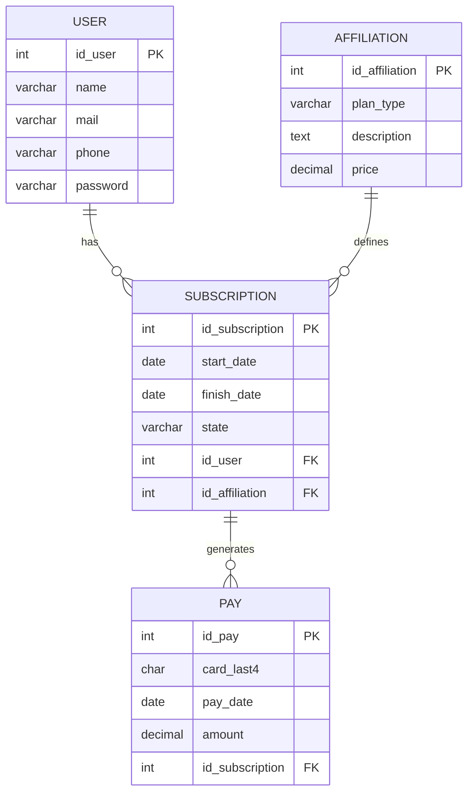

```mermaid
erDiagram
USER {
int id_user PK
varchar name
varchar mail
varchar phone
varchar password
}
AFFILIATION {
int id_affiliation PK
varchar plan_type
text description
decimal price
}
SUBSCRIPTION {
int id_subscription PK
date start_date
date finish_date
varchar state
int id_user FK
int id_affiliation FK
}
PAY {
        int id_pay PK
char card_last4
date pay_date
decimal amount
int id_subscription FK
}
USER ||--o{ SUBSCRIPTION : has
AFFILIATION ||--o{ SUBSCRIPTION : defines
SUBSCRIPTION ||--o{ PAY : generates
```
