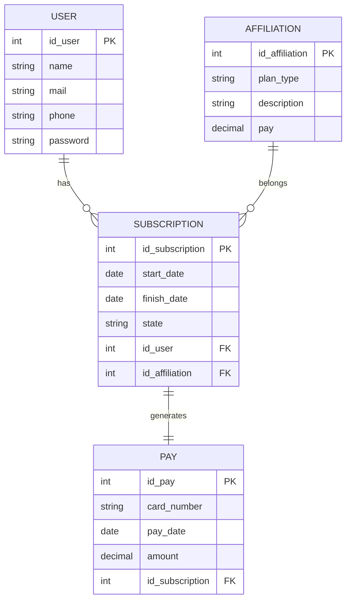

```mermaid
erDiagram

    USER {
        int id_user PK
        string name
        string mail
        string phone
        string password
    }

    AFFILIATION {
        int id_affiliation PK
        string plan_type
        string description
        decimal pay
    }

    SUBSCRIPTION {
        int id_subscription PK
        date start_date
        date finish_date
        string state
        int id_user FK
        int id_affiliation FK
    }

    PAY {
        int id_pay PK
        string card_number
        date pay_date
        decimal amount
        int id_subscription FK
    }

    USER ||--o{ SUBSCRIPTION : has
    AFFILIATION ||--o{ SUBSCRIPTION : belongs
    SUBSCRIPTION ||--|| PAY : generates
```
